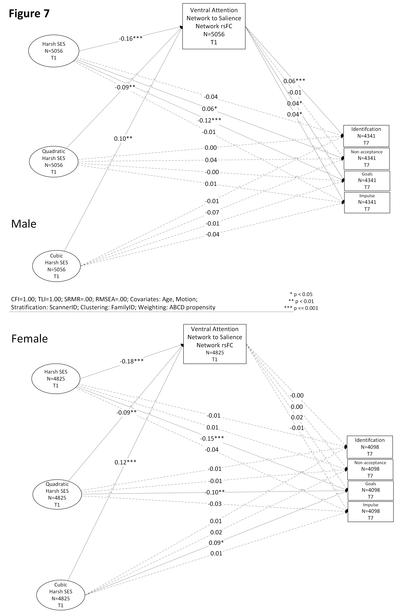
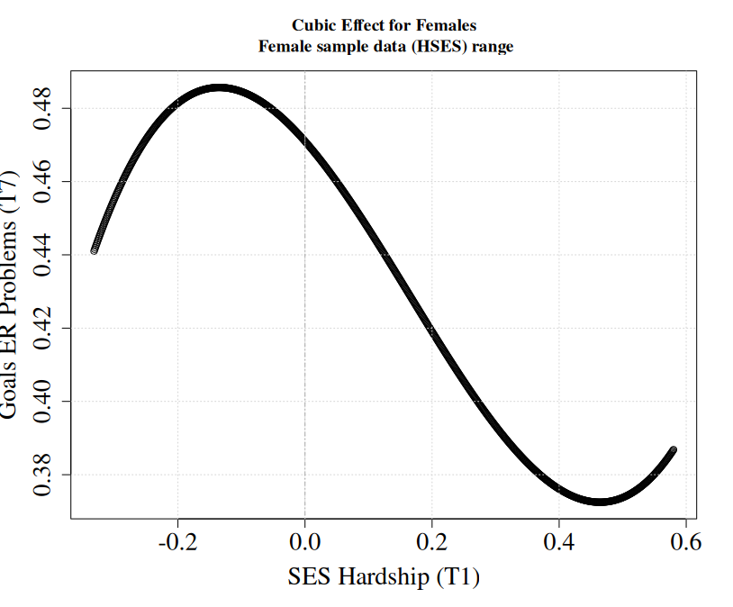
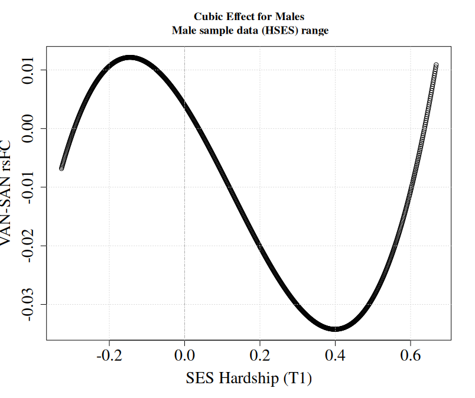
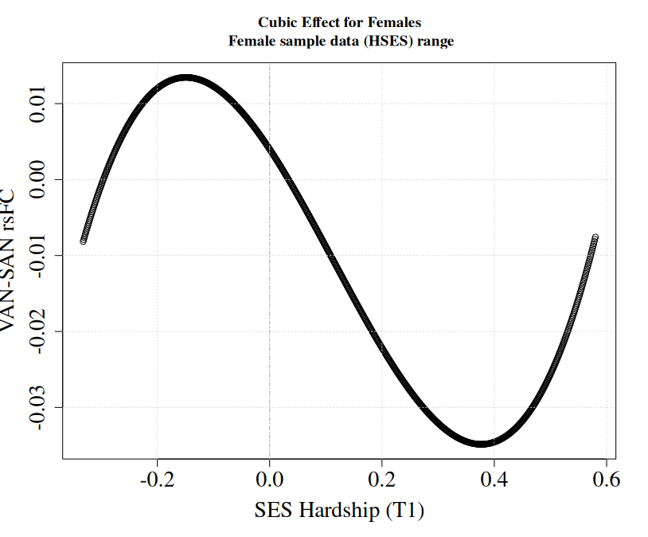

# Early Life Adversity can Benefit Some Dimensions of Emotion Regulation: Differential Assocations for Males and Females

In a sample of 9881 children (mean age 9.9 years at Time 1) from the Adolescent and Brain Development (ABCD) study, we examined associations bewteen early life adversity, emotion regulation, and fMRI resting-state functional connectivity. Using structural equation modeling (SEM) and based on the Hormetic model of stress which states that low-to-moderate levels of stress are optimal for certain cognitive and control processes, we examined linear and nonlinear associations between levels of harsh socioeconomic status (HSES) at Time 1 (T1), represented as a latent factor of 6 deprivation indicators, and emotion regulation dimensions at Time 7 (T7; 3 years later), measured by the Difficulties in Emotion Regulation (DERS) subscales - Identification, Nonacceptance, Goals, and Impulse. Increased resting-state functional connectivity (rsFC) in the ventral attention (VAN) and salience networks (SAN) is associated with emotional dysregulation, with the SAN regulating awareness between external and internal emotionally salient information. Thus, we hypothesized a mediating role for VAN-SAN rsFC at Time 1 between HSES and emotion regulation, with the assocaitions to specific dimensions being an open question. Due to differential susceptibiity of females versus males to emotion and mood disorders, we constructed separate models for males and females.

Linear Effects:
* For males and females, HSES at T1 exhibits a significant negative linear association with DERS Goals at T7, reflecting that HSES environments can imbue reduced Emotion regulation (ER) problems for Goals. For males only, this link is significantly mediated by Ventral Attention Network to Salience Network (VAN-SAN) rsFC T1, whereby HSES significantly reduces VAN-SAN rsFC which is significantly linked to fewer ER problems for Goals
* In contrast for males only, HSES T1 is significantly positively related to DERS Nonacceptance T7, reflecting that HSES environments can lead to more Emotion regulation (ER) problems for Nonacceptance. VAN-SAN rsFC does not mediate this impairment.
* Accordingly, males and females who are reared in SES hardship exhibit improvements in their ability to use goals to focus and get things done when emotional. Mechanistically, these effects result from reduced VAN-SAN rsFC for males, suggesting that individual differences in male's ability to switch attention between one's internal emotional state and external stimuli may play a role. The mechanism for females remains an open question.
* In males, the impairment of HSES on DERS nonacceptance may result from the tendency to not accept or ignore one's emotions when living in harsh environments. In line with this notion, VAN-SAN rsFC is a not a mechanism of this effect, as a nonacceptance of emotions would involve little saliency or attention to emotions.

Nonlinear Effects:
* For females on the c-prime path, there is a significant negative quadratic and positive cubic association between HSES at T1 and DERS Goals at T7, reflecting an initial increase in Goals ER problems at low HSES levels, possibly due to having little experience handling distressful environments, followed by reductions in Goals ER problems with increasing HSES levels until at the highest HSES level where Goals ER problems begin to increase again.  Females' ability to concentrate and be productive in emotional states improves at moderate to high levels of SES hardship. Accordingly, the effect of HSES on Goals ER problems can best be described as cubic, consisting of linear and higher-order components, for females. For males, no quadratic or cubic effects are present for the c-prime path.
* On the a-path for males and females, there is a significant negative quadratic and positive cubic association between HSES and VAN-SAN rsFC.  These effects, which are generally similar for males and females, reflect increasing connectivity at the lowest and highest levels, possibly reflecting overly heightened saliency and attentive processes when SES hardship is low or excessively high. Moderate levels of HSES may optimally tune the VAN-SAN rsFC for allocating the appropriate saliency to emotional distress.